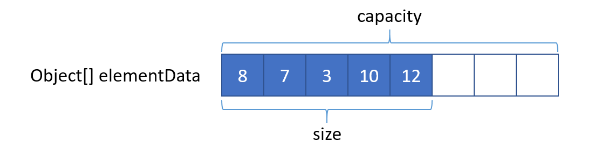

### ArrayList 介绍
　　ArrayList 底层通过数组实现，即 Object[]，以便能够容纳任何类型的对象。每次执行添加操作，需先判断索引是否越界，容量是否足够。如不够，则会进行扩容。注意，这里是新建一个数组，其容量大小为旧数组的 1.5 倍，然后将旧数组的值一一复制到新数组里，再执行添加操作。**初始默认大小是 10，最好能事先指定数组大小，否则当添加对象很多时，需扩容多次，即复制多次，浪费时间。** <br />
　　在执行删除操作时，需要将删除过后多出来的空间赋值为 null，表示没有引用，这样才能让 GC 回收，否则表示依然有引用指向它，导致内存泄露。
  


　　**ArrayList 为非线程安全的，多线程需使用 Synchronized 或是用 Vector 替代。Vector 与 ArrayList 区别在于 Vector 的方法加了 Synchronized，代码上与 ArrayList 基本相同。**

```java
public class ArrayList<E> extends AbstractList<E>
        implements List<E>, RandomAccess, Cloneable, java.io.Serializable {
    private static final long serialVersionUID = 8683452581122892189L;
    // 默认容量大小
    private static final int DEFAULT_CAPACITY = 10;
    // Object 对象数组，用于返回空的
    private static final Object[] EMPTY_ELEMENTDATA = {};

    private static final Object[] DEFAULTCAPACITY_EMPTY_ELEMENTDATA = {};

    transient Object[] elementData; // non-private to simplify nested class access
    
    // 数组大小
    private int size;
    
    // 记录 list 的修改次数，用于迭代时判断是否有修改，原理类似 CAS
    protected transient int modCount = 0;
```

### ArrayList(int initialCapacity)
　　构造函数，构造一个 ArrayList。

- 对初始容量 initialCapacity 的输入进行判断，小于 0 则抛出错误；
- 大于 0，则新建一个数组 Object[]；
- 等于 0，则引用一个空的数组。
  
```java
    private static final Object[] EMPTY_ELEMENTDATA = {};

    public ArrayList(int initialCapacity) {
        // 对初始容量判断
        if (initialCapacity > 0) {
            // 大于 0，新建一个 Object 对象数组
            this.elementData = new Object[initialCapacity];
        } else if (initialCapacity == 0) {
            this.elementData = EMPTY_ELEMENTDATA;
        } else {
            throw new IllegalArgumentException("Illegal Capacity: "+ initialCapacity);
        }
    }
    
    private static final Object[] DEFAULTCAPACITY_EMPTY_ELEMENTDATA = {};

    /**
     * 构造一个空的 ArrayList
     */
    public ArrayList() {
        this.elementData = DEFAULTCAPACITY_EMPTY_ELEMENTDATA;
    }
    
    /**
     * 将 Collection 集合转为 ArrayList，通过复制方法复制到新数组
     */
    public ArrayList(Collection<? extends E> c) {
        elementData = c.toArray();
        if ((size = elementData.length) != 0) {
            // c.toArray might (incorrectly) not return Object[] (see 6260652)
            if (elementData.getClass() != Object[].class)
                elementData = Arrays.copyOf(elementData, size, Object[].class);
        } else {
            // 容量大小为 0，返回空数组
            this.elementData = EMPTY_ELEMENTDATA;
        }
    }
```

### [get、set、size、isEmpty](https://github.com/martin-1992/Java-Collection-Source-Code/blob/master/ArrayList/get.md)

- get，返回该列表对应的索引位置的元素，时间复杂度为 O(1)；
- set，在列表的对应索引位置，新值覆盖旧值，返回旧值，时间复杂度为 O(1);
- size，返回数组大小，，时间复杂度为 O(1);
- isEmpty，根据数组大小是否为 0 来判断数组是否为空，时间复杂度为 O(1)。

### [indexOf、contains、lastIndexOf](https://github.com/martin-1992/Java-Collection-Source-Code/blob/master/ArrayList/indexOf.md)
　　通过遍历，来找到与指定元素相等的索引位置，时间复杂度为 O(n)。

- indexOf，通过遍历，获得该元素在数组中的索引位置（返回第一个与该元素相等的），时间复杂度为 O(n);
- contains，数组中是否存在该元素，通过遍历数组中的元素，判断索引是否大于 0，时间复杂度为 O(n);
- lastIndexOf，与 indexOf 的区别是，indexOf 是从前往后遍历，获取第一个与该元素相等的索引位置。而 lastIndexOf 是从后往前遍历，获取最后一个与该元素相等的索引位置，时间复杂度为 O(n)。

### [add、addAll](https://github.com/martin-1992/Java-Collection-Source-Code/blob/master/ArrayList/add.md)
　　添加时要对数组容量进行判断，是否有足够空间存放添加的元素，没则 1.5 倍扩容，复制到新数组中。

- add，添加元素到列表末尾，不扩容时间复杂度为 O(1)，扩容时间复杂度为 O(n);
- addAll，在末尾添加多个元素值，不扩容时每个添加操作时间复杂度为 O(1)，扩容时间复杂度为 O(n)。

### [clear、trimToSize](https://github.com/martin-1992/Java-Collection-Source-Code/blob/master/ArrayList/clear.md)

- clear，遍历列表，将列表中的每个元素置为空。注意列表对象不为空，不会被 GC 回收，时间复杂度为 O(n)；
- trimToSize，调整当前列表实例的大小，当列表大小 size 小于列表当前的实际大小，则新建一个列表，将当前列表的值复制到新的列表。通常用于扩容后的列表中有很多值被删除，导致实际容量小于列表大小，可通过该方法，减少列表大小，释放内存，时间复杂度为 O(n)。

### [ensureCapacity、grow](https://github.com/martin-1992/Java-Collection-Source-Code/blob/master/ArrayList/ensureCapacity.md)
　　扩容为新建数组，大小为原数组大小的 1.5 倍（位运算，旧数组大小 >> 1，即除以 2）。判断 1.5 倍大小的值是否溢出，溢出则使用最大值，然后将值复制到新数组中。

- ensureCapacity，判断是否需要增加 ArrayList 实例的容量，确保可以容纳指定容量的元素；
- grow，数组扩容方法，只扩容一次，为旧数组的 1.5 倍大小。然后判断扩容后的大小是否溢出，溢出则需判断指定容量的值是否溢出。

### [remove、removeAll、retainAll](https://github.com/martin-1992/Java-Collection-Source-Code/blob/master/ArrayList/remove.md)
　　移除元素，通过往前移动一格，将后面的值覆盖要删除的值，本质还是复制操作。

- remove，移除指定索引的值，时间复杂度为 O(n)；
- removeAll，批量移除，如果 Collection 为 ArrayList，时间复杂度为 O(n^2)；
- retainAll，与 removeAll 相反，两个集合的交集保留，即将包含的对象往前移。

### [toArray、clone](https://github.com/martin-1992/Java-Collection-Source-Code/blob/master/ArrayList/toArray.md)

- toArray，将数组中的元素复制到新数组，并返回，时间复杂度为 O(n)；
- clone，复制一个数组，将数组的元素复制到新数组中，时间复杂度为 O(n)。

### [Iterator](https://github.com/martin-1992/Java-Collection-Source-Code/blob/master/ArrayList/Iterator.md)
　　迭代器，用于遍历列表中的元素。
  
### 总结

- 对数组的操作，通过遍历、复制来实现的；
  1. 遍历，查找指定的值、指定的索引；
  2. 复制，扩容、覆盖要删除的值。
- 在进行数组操作（比如添加、查找值时），要先进行参数校验。
  1. 检查输入的索引是否合法，小于 0 或越界；
  2. 检查数组是否能存放新的值，是否要扩容；
  3. 检查扩容后的大小是否为溢出值。
