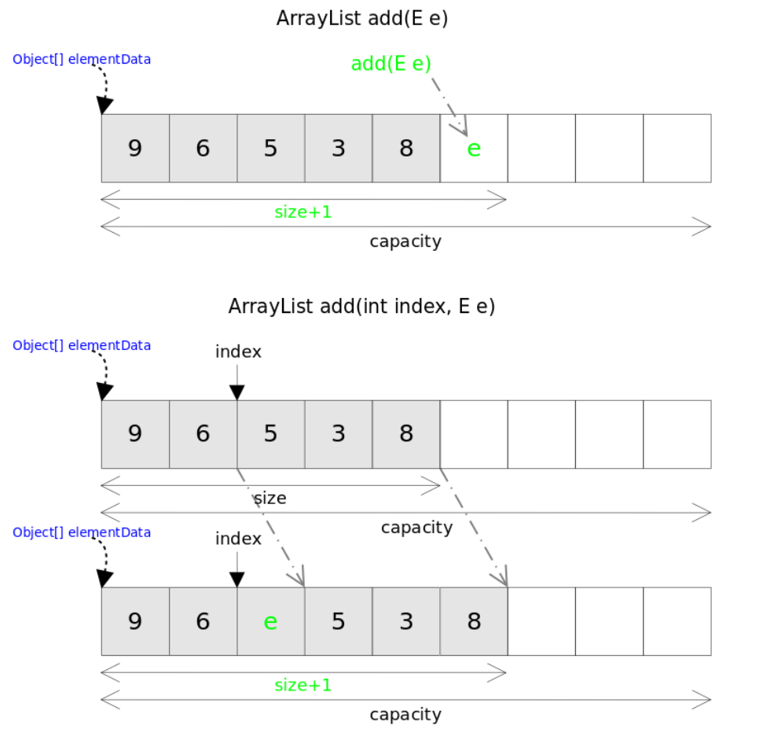

### add
　　添加元素到列表末尾，不扩容时间复杂度为 O(1)，扩容时间复杂度为 O(n)。

- 在添加新元素时，首先需要对数组的容量进行判断；
- ensureCapacityInternal，确保列表有足够的空间添加元素。如数组容量不够，则对其进行扩容，注意是新建一个数组，其容量大小为旧数组的 1.5 倍，然后将旧数组的值复制到新数组；
- 最后将新元素的值添加到新数组里，同时 size + 1。

```java
    public boolean add(E e) {
        ensureCapacityInternal(size + 1);  // Increments modCount!!
        elementData[size++] = e;
        return true;
    }
```



### add(int index, E element)
　　往指定位置添加新元素，时间复杂度为 O(n)。

- 先判断输入的索引是否小于 0，或越界；
- 判断是否需要扩容；
- 将 index 后的元素往后移一格，插入新元素值，线性时间复杂度；
- 容量 size + 1。

```java
public void add(int index, E element) {
    // 判断索引是否小于 0，或大于数组长度
    rangeCheckForAdd(index);
    // 判断是否需要扩容
    ensureCapacityInternal(size + 1);
    // 将 index 后的元素往后移一格，插入新元素值
    System.arraycopy(elementData, index, elementData, index + 1, size - index);
    elementData[index] = element;
    size++;
}
```

#### rangeCheckForAdd
　　输入输入的索引是否小于 0，或越界。

```java
    private void rangeCheckForAdd(int index) {
        if (index > size || index < 0)
            throw new IndexOutOfBoundsException(outOfBoundsMsg(index));
    }
```

#### ensureCapacityInternal
　　确保列表有足够的空间添加元素。

- calculateCapacity，如果数组为空，判断指定容量 minCapacity 是否大于 10，不是则返回 10，即列表最小容量为 10；
- [grow](https://github.com/martin-1992/Java-Collection-Source-Code/blob/master/ArrayList/ensureCapacity.md)，指定容量大于数组容量的大小，则以 1.5 倍进行扩容，同时判断扩容的值是否溢出。

```java
    private void ensureCapacityInternal(int minCapacity) {
        ensureExplicitCapacity(calculateCapacity(elementData, minCapacity));
    }
    
    private void ensureExplicitCapacity(int minCapacity) {
        modCount++;

        // minCapacity，为数组拥有的元素的容量
        // elementData.length，为当前数组的长度
        // 如果当前数组拥有的元素值所占容量大于数组容量，则数组空间不够，需将数组容量扩大 1.5 倍
        if (minCapacity - elementData.length > 0)
            grow(minCapacity);
    }
```

#### calculateCapacity

- 如果为数组为空，则返回容量最小为 10，最大为 minCapacity；
- 不为空，则返回 minCapacity。

```java
    private static final Object[] DEFAULTCAPACITY_EMPTY_ELEMENTDATA = {};
    
    private static final int DEFAULT_CAPACITY = 10;

    private static int calculateCapacity(Object[] elementData, int minCapacity) {
        if (elementData == DEFAULTCAPACITY_EMPTY_ELEMENTDATA) {
            return Math.max(DEFAULT_CAPACITY, minCapacity);
        }
        return minCapacity;
    }
```

### addAll(Collection<? extends E> c)
　　在末尾添加多个元素值，不扩容时每个添加操作时间复杂度为 O(1)，扩容时间复杂度为 O(n);
  
- 首先将其转为对象数组；
- 判断是否需要扩容；
- 将要添加的对象数组的值添加到数组里。
　　
```java
public boolean addAll(Collection<? extends E> c) {
    // 转为对象数组
    Object[] a = c.toArray();
    // 要添加数组的长度
    int numNew = a.length;
    // 判断是否需要扩容
    ensureCapacityInternal(size + numNew); 
    // 将各个元素复制到数组 elementData 中
    System.arraycopy(a, 0, elementData, size, numNew);
    // 当前数组长度 + 添加数组的长度
    size += numNew;
    return numNew != 0;
}
```

### addAll(int index, Collection<? extends E> c)
　　往指定位置添加多个元素值，addAll() 的时间复杂度跟插入元素的多少和插入位置有关。如果是在末尾插入，则不需移动数组里的元素值。
  
- 检查输入的索引是否合法，即是否大于 0，且小于数组容量；
- 判断是否需要扩容；
- 判断是否需要移动数组里元素的值，以便进行插入操作。

```java
public boolean addAll(int index, Collection<? extends E> c) {
    rangeCheckForAdd(index);

    Object[] a = c.toArray();
    int numNew = a.length;
    ensureCapacityInternal(size + numNew);  
    // 判断要插入的位置是在容量里，还是容量外，比如旧数组里有 5 个元素值，
    // 索引为 8，这时就不需要移动数组里的元素值，而是在 index=8 位置插入
    int numMoved = size - index;
    if (numMoved > 0)
        // 大于 0，表示 size 比 index 大，即需要移动数组中的元素
        System.arraycopy(elementData, index, elementData, index + numNew,
                         numMoved);
    // 小于 0，不需要移动，往数组指定索引 index 插入即可，都为空
    System.arraycopy(a, 0, elementData, index, numNew);
    size += numNew;
    return numNew != 0;
}
```
