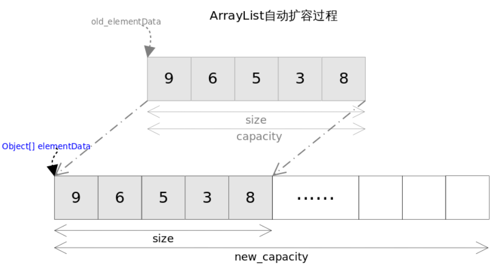

### ensureCapacity
　　判断是否需要增加 ArrayList 实例的容量，确保可以容纳指定容量的元素。

- 先判断最小容量 minCapacity 是否大于 minExpand；
- 如大于 minExpand，再判断是否大于列表大小 elementData.length；
- 大于列表大小，则进行扩容。

```java
    public void ensureCapacity(int minCapacity) {
        // 如果是调用无参构造函数，即为 DEFAULTCAPACITY_EMPTY_ELEMENTDATA，
        // 则会返回一个长度为 10 的数组
        int minExpand = (elementData != DEFAULTCAPACITY_EMPTY_ELEMENTDATA)
            // any size if not default element table
            ? 0
            // larger than default for default empty table. It's already
            // supposed to be at default size.
            : DEFAULT_CAPACITY;
        
        // 最小容量大于 minExpand，则以最小容量来扩容
        if (minCapacity > minExpand) {
            ensureExplicitCapacity(minCapacity);
        }
    }

    private void ensureExplicitCapacity(int minCapacity) {
        modCount++;

        // 最小容量大于列表大小，扩容
        if (minCapacity - elementData.length > 0)
            grow(minCapacity);
    }
```



### grow
　　数组扩容方法，只扩容一次，为旧数组的 1.5 倍大小。然后判断扩容后的大小是否溢出，溢出则需判断指定容量的值是否溢出。

- 新容量为旧容量的 1.5 倍大小，使用位运算获得 0.5 倍大小，速度更快；
- 新容量小于最小容量，以最小容量为准，这里两个值通过相减判断是否谁大谁小，而不是两个数进行比较，考虑到溢出情况；
- 如果新容量大小大于 MAX_ARRAY_SIZE，则对指定容量进行判断，因为新容量是根据指定容量进行扩充的；
- [hugeCapacity](#hugeCapacity)，当指定容量大于数组最大容量，则返回整数型的最大容量，否则返回数组的最大容量。

```java   
    private static final int MAX_ARRAY_SIZE = Integer.MAX_VALUE - 8;

    private void grow(int minCapacity) {
        int oldCapacity = elementData.length;
        // 新容量大小为旧容量大小的 1.5 倍，这里使用位运算 >> 1 相当于除以 2
        int newCapacity = oldCapacity + (oldCapacity >> 1);
        if (newCapacity - minCapacity < 0)
            // 新容量比最小容量还小，则将新数组容量设为最小容量
            newCapacity = minCapacity;
        if (newCapacity - MAX_ARRAY_SIZE > 0)
            // 新数组容量比数组最大容量还大，即为溢出，则判断是否使用数组最大容量
            newCapacity = hugeCapacity(minCapacity);
        // 将旧数组的值一一复制到新数组里
        elementData = Arrays.copyOf(elementData, newCapacity);
    }

    private static int hugeCapacity(int minCapacity) {
        if (minCapacity < 0) // overflow
            throw new OutOfMemoryError();
        return (minCapacity > MAX_ARRAY_SIZE) ?
            Integer.MAX_VALUE :
            MAX_ARRAY_SIZE;
    }
```

### hugeCapacity<a id='hugeCapacity'></a>

- 指定容量小于 0 则抛异常；
- 指定容量大于数组最大容量，则返回整数型的最大容量，否则返回数组的最大容量。

```java
    private static int hugeCapacity(int minCapacity) {
        if (minCapacity < 0) // overflow
            throw new OutOfMemoryError();
        return (minCapacity > MAX_ARRAY_SIZE) ?
            Integer.MAX_VALUE :
            MAX_ARRAY_SIZE;
    }
```
