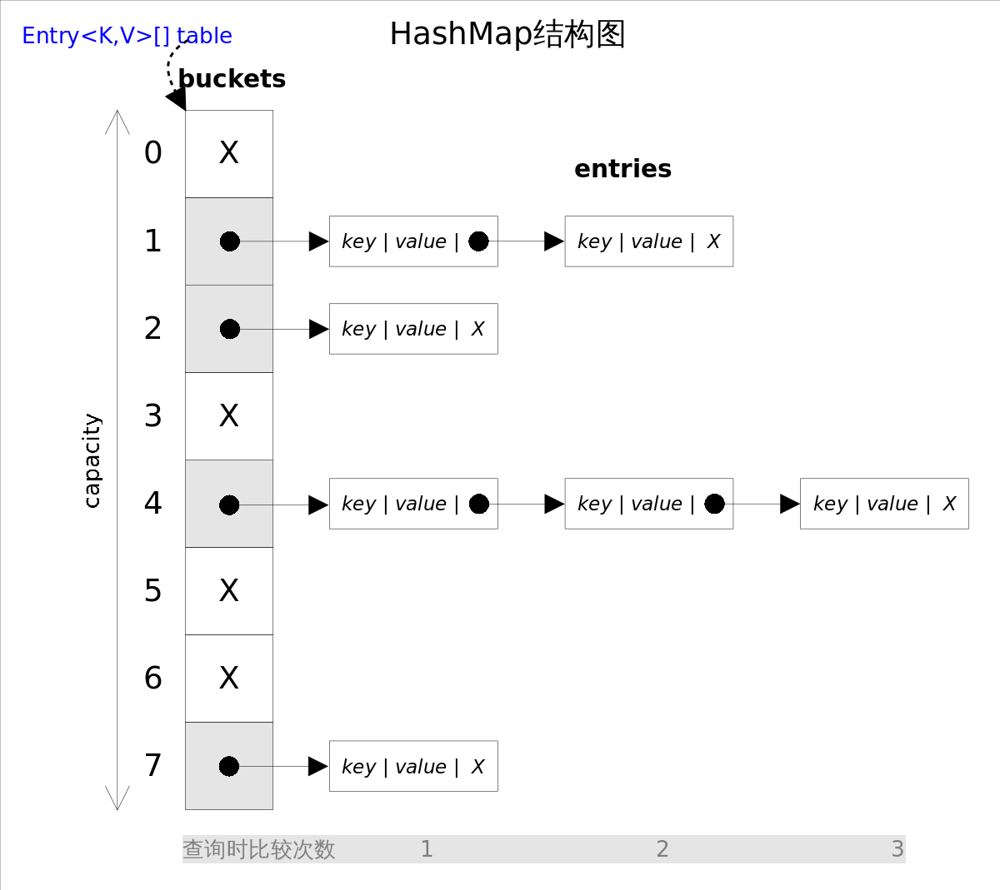

### HashMap
　　HashMap 是由数组 + 链表 + 红黑树组成，数组中每个值为链表节点或红黑树节点，当链表长度大于 8 时，会转为红黑树。HashMap 在哈希时遇到哈希冲突，即不同的对象值，但哈希值是一样的。对于哈希冲突，有两种处理方法：

- 开放地址方法，以最简单的线性探测法为例。当数组中某个位置有值时，则会往后寻找下一个空位，如果没找到则从头开始寻找空位，ThreadLocalMap 使用这种方法；
- 链表方法，在冲突的位置建立一个链表，将值放到链表后，相当于数组中的每个值存的是链表对象。



### 构造函数
　　HashMap 是由数组 + 链表 + 红黑树组成，链表使用节点 [Node](https://github.com/martin-1992/Java-Collection-Source-Code/blob/master/HashMap/Node.md)，红黑树使用 [TreeNode]()，通过 instanceof TreeNode 可判断该节点是为红黑树还是链表，然后在依据不同数据结构调用不同方法。<br />
　　**HashMap 的容量必须为 2 的次方，这样可使用位运算，根据 (n - 1) & hash(key) 来获得该 key 在数组中的索引位置 index，等价于取模运算。** 因为 2 的次方值高位为 1，低位为 0，比如 8 为 1000，减去 1 为 0111 即掩码，掩码在和 hash(key) 进行相与 & 操作，高位的值会被抹掉，剩余低位，即是等价于 hash(key) % tab.length。同时，只有全是 1，才会有更多哈希结果，因为使用 &，0 & 1 是没法得到 1 的，哈希结果会变少。<br />
　　由于使用掩码，会导致高位值被抹掉，如果这时出现一类 hash，是高位才有变化，低位没变化，比如 1000000010000000000000000000000，这时跟掩码值进行相与 & 操作，高位抹去，低位相与为 0，导致这类 hash 都指向数组为 0 的索引，出现严重的哈希冲突。<br />
　　于是，为避免这种情况，高位的值右移 16 位，转为低位，和原先的 hash 值在做一次异或操作。如果是 1000000010000000000000000000000，则低 16 位和高 16 相同，即 10000000100000001000000010000000，这时在做掩码，即使高位被抹掉，也不会都指向索引位为 0。

```java
public class HashMap<K,V> extends AbstractMap<K,V>
    implements Map<K,V>, Cloneable, Serializable {
    
    // 默认初始容量，1 向左移动 4 位，为 16
    static final int DEFAULT_INITIAL_CAPACITY = 1 << 4; 

    // 最大容量，向左移动 30 位，这是最大的且为 2 次方的数，最大值为 2 ^ 31 - 1，
    // 取不到 31 次方，所以取 30 次方
    static final int MAXIMUM_CAPACITY = 1 << 30;

    // 负载因子，比如最大容量为 100，负载因子 0.75，则 100 * 0.75 = 75，
    // 当 HashMap 的容量达到 75 时，则进行扩容
    static final float DEFAULT_LOAD_FACTOR = 0.75f;

    // 链表长度为 8，转为红黑树
    static final int TREEIFY_THRESHOLD = 8;
    
    /**
     * 构造函数
     */
    public HashMap(int initialCapacity, float loadFactor) {
        // 参数校验，初始容量小于 0，抛出异常
        if (initialCapacity < 0)
            throw new IllegalArgumentException("Illegal initial capacity: " +
                                               initialCapacity);
        // 大于最大容量，设置为最大容量
        if (initialCapacity > MAXIMUM_CAPACITY)
            initialCapacity = MAXIMUM_CAPACITY;
        // 参数校验，负载因子
        if (loadFactor <= 0 || Float.isNaN(loadFactor))
            throw new IllegalArgumentException("Illegal load factor: " +
                                               loadFactor);
        this.loadFactor = loadFactor;
        // 校准设置的容量，必须是 2 的次方
        this.threshold = tableSizeFor(initialCapacity);
    }
```

### hash
　　获取该 key 的 hash 值。

```java
    static final int hash(Object key) {
        int h;
        // 求出该 key 的 hashCode 后，将其高位移到低位，再做一次异或操作，如果低位全为 0，
        // 则可以保留高位的值，这样掩码抹消高位也不会全指向 0
        return (key == null) ? 0 : (h = key.hashCode()) ^ (h >>> 16);
    }
```

### tableSizeFor
　　校准设置的容量，必须是 2 的次方。

```java
    static final int tableSizeFor(int cap) {
        int n = cap - 1;
        n |= n >>> 1;
        n |= n >>> 2;
        n |= n >>> 4;
        n |= n >>> 8;
        n |= n >>> 16;
        return (n < 0) ? 1 : (n >= MAXIMUM_CAPACITY) ? MAXIMUM_CAPACITY : n + 1;
    }
```

### [**get**](https://github.com/martin-1992/Java-Collection-Source-Code/blob/master/HashMap/get.md)
　　获取该 key 对应的 value 值，通过 (n - 1) & hash(key) 找到该 key 在数组中的索引位置 index，然后在该位置 index 遍历链表或红黑树，找到返回该 key 的 value，没找到返回 null。

- 先判断节点数组是否不为空，使用 (n - 1) & hash(key) 找到该 key 在数组中对应的索引位置 index；
- 遍历该索引位置的链表，先检查第一个节点，判断是否为要找到节点，如果这里没有重写 equals，可能导致相等的 key，却判断为不相等，导致出错；
- 如果不是第一个节点，则会判断下个节点，如果下个节点为 TreeNode，则调用红黑树的方法来判断（当链表长度大于 8，会转为红黑树），否则调用链表的方法来判断，继续遍历，直到没找到返回 null。

### [**put**](https://github.com/martin-1992/Java-Collection-Source-Code/blob/master/HashMap/put.md)
　　将 key 插入 Map 中，通过 (n - 1) & hash(key) 找到该 key 在数组中的索引位置 index，然后执行插入或覆盖旧值操作。

- 数组为空，则先进行扩容，因为要插入值；
- 没有找到该 key 的哈希值，即在数组中没有该索引 (n - 1) & hash(key)，则将该值包装成节点 Node，插入数组中。插入新节点成功，返回 null；
- 数值中存在该 key，有三种情况：
    1. 该 key 和要插入的 key 是相同的，则覆盖掉旧的 key；
    2. 哈希冲突，插入红黑树；
    3. 哈希冲突，将该值构造成节点，插入链表末尾。如果链表长度 binCount 大于 8，则转为红黑树。

### [**remove**](https://github.com/martin-1992/Java-Collection-Source-Code/blob/master/HashMap/remove.md)
　　移除该 key，通过 (n - 1) & hash(key) 找到该 key 在数组中的索引位置 index，然后执行链表删除操作或红黑树删除操作。

- 从 Map 中找到该 Key 对应的节点，没找到返回 null；
- 找到，则首先判断是否为首节点，不是则遍历红黑树或遍历链表；
- 找到该节点后，则根据不同数据结构执行删除操作。先判断该节点是否属于红黑树，，然后再判断是否为首节点，最后用链表撒删除方法。

### [**resize**](https://github.com/martin-1992/Java-Collection-Source-Code/blob/master/HashMap/resize.md)
　　使用 << 1 进行两倍扩容，扩容时需先进行参数校验，是否溢出等。然后遍历旧数组的每个节点，对其进行重新哈希，填充的索引位置有两种：与原先索引位置一致，新索引位置即原先索引位置加上旧容量的大小。

- 参数校验，旧容量大于最大容量，没法扩容了，返回旧数组。而如果旧容量乘以 2 是小于最大容量，则新容量是旧容量的两倍；
- 当旧容量是小于等于 0 时，而旧阈值是大于 0，则直接将新容量设置为旧阈值；
- 旧容量小于等于 0，旧阈值也是，则设置新容量为默认值；
- 旧阈值为 0，表示负载因子 DEFAULT_LOAD_FACTOR 为 0，它是可修改的，使用不可修改的默认负载因子 loadFactor 来获得阈值，并判断是否溢出；
- 旧数组不为空，遍历旧数组的每个节点。
    1. 将旧数组的节点保存为 e，同时将旧数组对应的索引位置赋值为 null，用于 GC 回收；
    2. 只有一个节点的情况下，则直接哈希对新数组的容量求余数，获得新数组的索引位置；
    3. 多个节点情况下，需要根据 e.hash & oldCap 来判断高位是否为 1，是则新索引为 [旧索引位置 + 旧容量 oldCap]，不是则还是和旧索引位置一致。比如 00101 & 01111 和 00101 & 011111 是相等的，即使扩容两倍后，相与 & 的索引值不变。而 10101 & 01111 和 10101 & 011111 则是不等的，扩容两倍后，新索引的值是旧索引位置 + 旧容量 oldCap。

### [**clear**](https://github.com/martin-1992/Java-Collection-Source-Code/blob/master/HashMap/clear.md)
　　清空 Map 中的 key，遍历数组 Map，将每个节点赋值为空。

