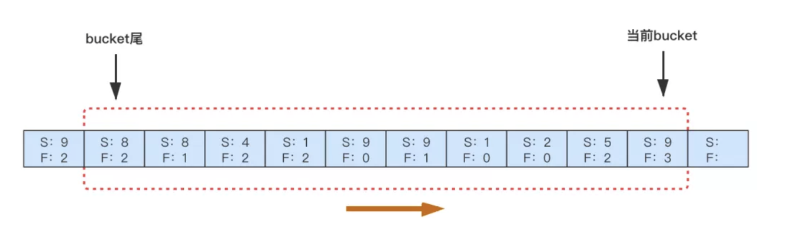
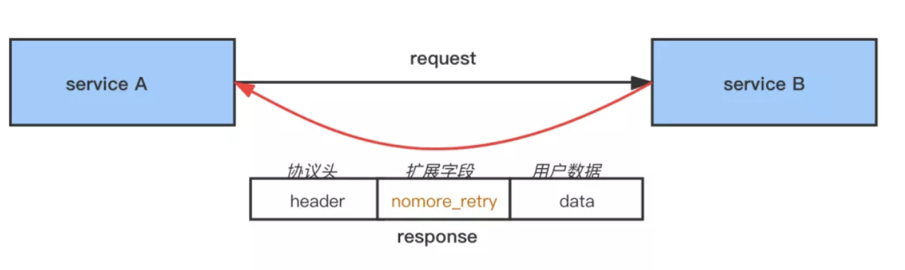
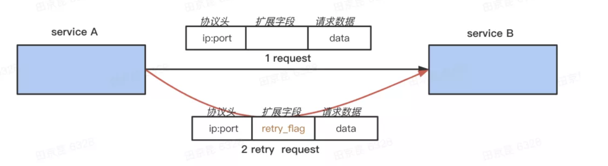
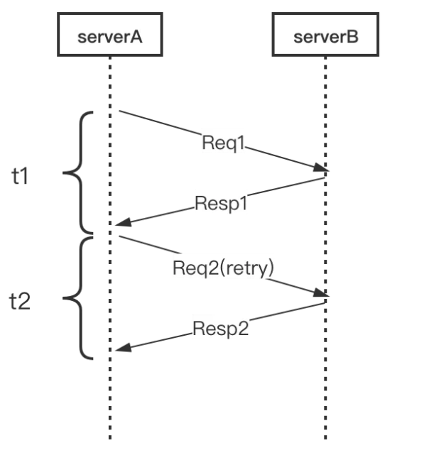
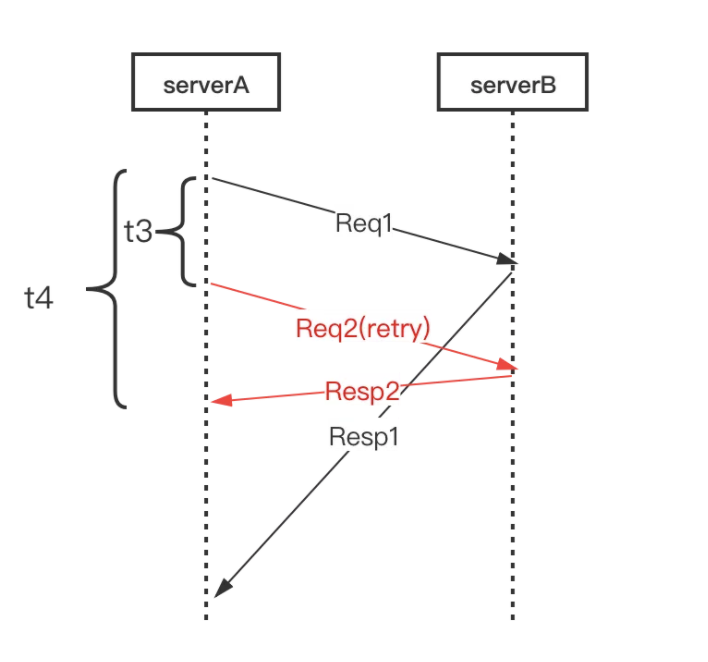
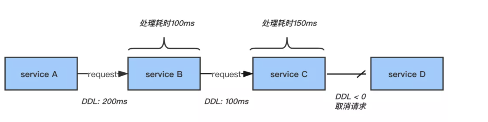

### 前言
　　本篇为 [如何优雅地重试](https://mp.weixin.qq.com/s/6IkTnUbBlHjM3GM_bT35tA) 的笔记，推荐阅读原文章。

### 重试意义
　　微服务架构中，一个大系统是由多个小服务组成的。在调用服务时，存在失败情况，且大部分是由于网络抖动原因导致的，这时就需要进行重试。

### 重试风险

- 重试会直接加大下游的负载。比如 A 服务调用 B 服务失败，因为 B 服务处于高负载导致的，不是网络抖动。这时 A 服务再重试，会加大 B 服务的负载，导致其挂掉；
- 存在链路放大的效应。比如，A 服务调用 B 服务，重试 3 次。每次重试时，B 服务会调用 C 服务，失败又会重试 3 次。相当于 C 服务会被调用 9 次。如果有 n 层，则会指数放大，导致整个系统雪崩；
- 幂等性，非幂等性是不进行重试，造成信息错误。

### 重试需考虑的参数

- 重试次数；
- 延时多久，进行重试；
- 捕捉哪些异常，才进行重试；
- 退避策略，失败多久后进行重试。一般网络抖动是有个短暂的时间，如果立刻重试，可能会再次失败。
	1. 线性退避，每次等待固定时间后重试；
	2. 随机退避，随机等待一个时间，进行重试；
	3. 指数退避，每次重试时，等待时间是上一次的倍数。

### 防止重试放大效应

- 重试熔断，限制单点的放大倍数；
- 重试错误码，保证只有最下层进行重试；
- 重试请求 flag 链路下传的方式来保证对重试的请求不进行不重试。

#### 限制单点重试
　　重试次数有上限，更重要是限制重试请求的成功率。 
　　实现方案，是基于断路器思想，通过计算请求失败/请求成功的比率，来判断是否进行重试或是熔断。

　　如上图，每个 RCP 服务都维护一个滑动窗口。假设这里为 A 服务的滑动窗口，有 10 个桶，每个桶记录了 1S 内该服务的请求成功 S 和请求失败 F 的数据。10 个桶，记录了最新 10 秒的请求数据。 
　　假设阈值为 0.1，即 10S 内失败 / 成功的比率不能超过 0.1，这样下游最多承受 1.1 倍的 QPS，可根据需要自行调整熔断开关和阈值。

#### 限制链路重试
　　对于链路放大的解决方案，最重要是防止每层都进行重试，理想情况是只有下游的最下一层才进行重试，上层收到错误码后都不进行重试。参照 google sre 的方案：

- 统一约定一个特殊的 status code，表示调用失败，但别重试；
- 任何一级重试失败后，生成该 status code 并返回给上层；
- 上层收到该 status code 后停止对这个下游的重试，并将错误码再传给自己的上层。

　　需要对业务代码改造，抛这个错误码，这样上游收到这个错误码后，就不进行重试了。由于 RPC 调用复杂，链路可能非常长，这就需要协调好，和业务方配合进行大量改造，对业务入侵比较大。 
　　另一种，字节的方案，使用的内部 RPC 协议中有扩展字段，将错误码放在扩展字段 nomore_retry，告诉上游不再重试。

#### 超时处理
　　超时情况可能导致错误码失效，比如 A -> B -> C。

- B -> C 超时，B 没返回错误码给 A；
- A -> B 会进行重试；
- 这时 B -> C 重试成功，生成错误码，但不能传递给 A，导致 A 会重试 B。

　　如果每层都超时，错误码没法传递，还是会出现链路放大效应。

　　解决方案，是在重试请求 Request 中加一个特殊的 retry flag。

- A -> B 时，B 从请求中判断这个 flag 是不是重试请求的；
	1. 是则 B -> C 失败时，B 不会对 C 调用重试；
	2. 不是，则调用 C 失败后，会进行重试。
- 同时，B 会将这个 retry flag 传下去，有这个 flag 都不会对下游进行重试。

### 超时场景优化
　　RPC 请求结果有三种状态，成功、失败、超时。如下的超时场景，即使重试也不会成功。

- 上游和下游的超时时间一样，由于 C 负载高，导致 B -> C 超时 1000ms，而 A -> B 也由于超时 1000ms 而断开连接。这时 B -> C 在重试，则毫无意义；
- 另一种情况也类似，即上游的超时时间比下游的超时时间还短。

　　本质原因是因为链路上的超时时间设置得不合理，上游和下游的超时时间设置的一样，甚至上游的超时时间比下游还要短。 
　　正常地重试，如下图。当第一次请求 t1 失败时，才会进行第二次重试请求 t2。

#### Backup Requests

　　但通常情况下，一个请求不必等到超时才进行重试，假设它的 pct 为 100ms，那超过 100ms 即可判断为失败，进行提前重试。 
　　如下图，设置重试的阈值 t3 为 RPC 请求的 pct99。 **当请求 t1 超过阈值 t3，则再发起一个请求 t2，两个请求只要其中一个返回成功即可，总体耗时为 t4。**

　　该方案称为 Backup Requests，是用请求量来换成功率（低延时），这里也要使用熔断思想来限制重试发起多次请求。 
　　在重试前，会为第一次的请求记录一次失败，并检查当前失败率是否超过了熔断阈值。

#### DDL
　　为 Deadline Request 调用链超时简称，用于控制无效的重试，参考了 TCP/IP 协议中的 TTL 用于判断数据包在网络中的时间是否太长而应被丢弃。 
　　DDL 也是用于判断该 RPC 请求是否要继续传递下去，在一条链路上，该请求每经过一层就减去该层处理的时间。如果剩下时间小于 0，表示超时，就不继续往下传递请求了，返回失败，能最大限度减少没用的重试。

### 总结

- 重试熔断，请求失败 / 成功 > 0.1 时停止重试；
- 链路上传错误标志	，下层重试失败后上传错误标志，上层不再重试；
- 链路下传重试标志	，重试请求特殊标记，下层对重试请求不会重试；
- DDL，当剩余时间不够时不再发起重试请求；
- 框架熔断，微服务框架本身熔断、过载保护等机制也会影响重试效果。

### reference

- [如何优雅地重试](https://mp.weixin.qq.com/s/6IkTnUbBlHjM3GM_bT35tA)

