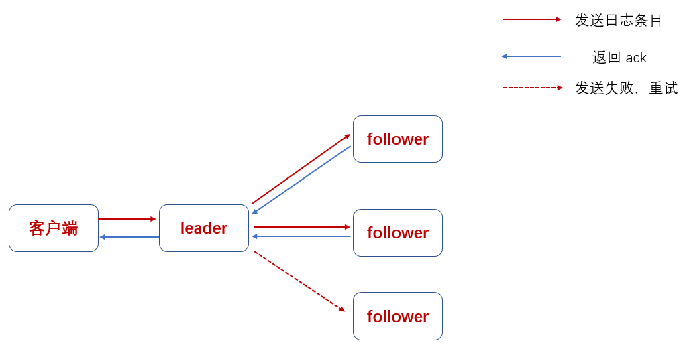
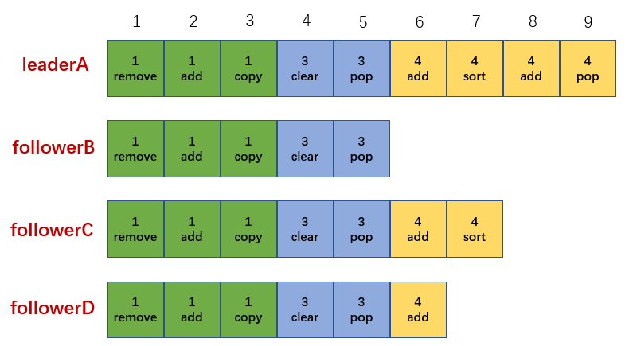
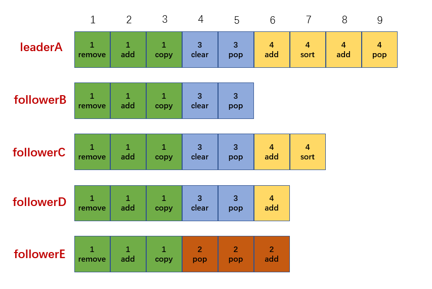

### 日志复制过程
　　分布式的目的，就是将日志（消息）同步到其它服务节点（副本）。保证 leader 挂了，也不会丢失数据，其它从服务器成为 leader 后还能正常提供服务。Raft 的 leader 选举机制，就是选出合适的 leader，继续执行日志复制。

　　如上图，当新 leader 被选举出来后，会为客户端提供服务。

- 客户端的会将请求命令发给 leader；
- leader 将请求命令添加到日志中，并行的发起附加日志 RPC 到其它集群的同一个 Raft Group 的服务器节点，服务节点会复制这条日志信息，响应返回 ack；
- 当这条日志复制到多数服务其节点中，leader 会应用这条日志条目到它的状态机中，然后把执行的结果返回给客户端；
- 当 follower 崩溃，导致 leader 没有收到 follower 的响应 ack。leader 会不断重试发送附加日志 RPC 请求，保证 follower 收到并存储日志消息。

### 日志组成

- 每条日志由任期号、索引号、状态机指令（或日志消息）组成；
- 日志中的任期号一定是趋势递增的，任期号和索引号是用于检查日志是否不一致，一切以 leader 为准；
    1. 任期号，创建日志时的任期号；
    2. 索引号，表示该日志条目在日志中的位置；
    3. leader 的日志只会增加，不会删除或覆盖；
    4. 从 follower 成为新 leader（任期号增加），一定包含旧 leader（旧任期号）的所有日志。 
- 日志需要同步到大多数服务器节点，才能提交。以下图为例，9 条日志，目前提交了 6 条，已提交的日志条目都是持久化的。

### Raft 的日志机制

- 如果在不同的日志中的两个日志条目拥有相同的索引和任期号，那么他们存储了相同的指令；
- 如果在不同的日志中的两个日志条目拥有相同的索引和任期号，那么他们之前的所有日志条目也全部相同。
    1. 在发送附加日志 RPC 时，leader 会把新的日志条目和之前条目的索引位置、任期号都包含在内；
    2. 如果 follower 在它的日志中找不到包含相同索引位置和任期号的条目，就会拒绝接受新的日志条目。

### 日志校验
　　在 Raft 算法中，当 leader 日志与 follower 日志不一致时，以 leader 日志为准，即 leader 会找到 follower 日志不一致的地方（索引），从这个点删除之后所有的日志，强制 follower 直接复制 leader 的日志，这些操作在进行附加日志 RPCs 的一致性检查时完成。在 [leader 选举]() 中提到，选举出来的 leader 保证含有大多数节点提交的日志。 

- 以上图为例，leader 对每个 follower 都维护了一个 nextIndex，表示下个需要发送给 follower 的日志条目的索引地址；
    1. leaderA 对 follower 的 nextIndex 为 6，即 leaderA 会将索引为 6 的日志发给 follower，以此类推；
    2. leaderA 中已提交的日志条目对应的索引为 6，因为大多数节点（leaderA、followerC、followerD）都包含了索引为 6 的和之前的日志条目；
- 当新的 leader 产生时，会先初始化所有的 nextIndex 值为自己的最后一条日志的 index 加一，上图中为 10；
- 如果一个 follower 的日志和 leader 日志不相同，那么在下一次的附加日志 RPC 时的一致性检查就会失败；
- 被 follower 拒绝后，leader 会减少 nextIndex 进行重试，最终 nextIndex 会在某个位置使得 leader 和 follower 的日志达成一致，这时附加日志 RPC 成功；
- 然后会将该 nextIndex 之后的冲突日志删除，加上 leader 的日志，这样 follower 的日志就和 leader 的日志保持一致，并在接下来的任期里一直继续保持；
    1. 以 followerE 为例，在任期 2 时当选为 leader，并响应客户端的服务，但没有同步到其它节点，就挂了；
    2. 任期 3 选出新 leaderA，并发送附加日志 RPC 到 followerE，不一致校验失败。于是 leaderA 不断减少 nextIndex 进行重试，最后在索引为 3 时达成一致，于是 followerE 删除索引为 3 之后的日志条目。
