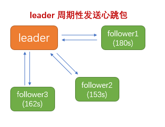
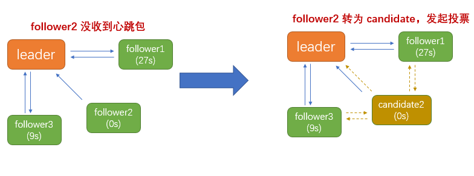

### 触发 leader 选举条件
　　Raft 使用心跳机制来触发 leader 选举的。Raft 有两种类性的 RPC，请求投票 RPC 和附加日志 RPC，心跳包属于空内容的附加日志 RPC。

- leader 会周期性向所有 follower 发送心跳包，来维持自己 leader 身份；
- 如果一个 follower，因为某些原因（比如网络问题，或是 leader 本身出问题宕机了）在一段时间内没收到任何消息，就会认为系统中没有可用的 leader，于是发起选举，选出新的 leader；
    1. 注意，每个 follower 的选举超时时间是随机的，在 150ms-300ms，保证大多数情况下只有一个 follower 转为 candidate 并发出选举投票 RPC，防止出现多个 candidate 选举的情况（脑裂）；
    2. 如果有两个 candidate 刚好随机的时间是一样的，出现共同选举的情况，因为这两个 candidate 都不能获取大多数选票，所以又会随机超时进行下次选举；
    3. 选举随机超时 + 大多数选票，保证选举在一个选举过程中最多只有一个 candidate 能选举成为 leader。

### 服务节点需遵守的规则
　　所有服务节点都需遵守以下规则：

- 如果 `commitIndex > lastApplied`，那么就 lastApplied 加一，并把 `log[lastApplied]` 应用到状态机中；
- 如果接收到的 RPC 请求或响应中，任期号 `T > currentTerm`，会更新自己的任期号 为 T，并将身份状态切换为 follower。比如 leader 发送心跳包到各 follower 节点，follower 会返回它的任期号。leader 节点检查发现任期号比 follower 的小，则会切换为 follower，并更新自己的任期号。

#### follower

- 响应来自 candidate 和 leader 的请求；
- 如果在超过选举超时时间的情况之前都没有收到 leader 的心跳，或者是 candidate 的请求投票，follower 就变成候选人。

#### candidate

- 在转变成 candidate 后就立即开始选举过程；
	1. 自增当前的任期号（currentTerm）；
	2. 给自己投票；
	3. 重置选举超时计时器；
	4. 发送请求投票的 RPC 给其他所有服务器。
- 如果接收到大多数服务器的选票，那么就变成 leader；
- 如果接收到来自新的 leader 的心跳包（空的附加日志 RPC），转变成 follower；
- 如果选举过程超时，再次发起一轮选举。每个节点的选举时间和超时时间是随机，就是为了防止同时出现两个 candidate。

#### leader

- candidate 成为 leader 后，发送空的附加日志 RPC（心跳）给其他所有的服务器，follower 会返回它的任期号；
    1. 在一定的空余时间之后不停的重复发送，以阻止 follower 超时转变为新 leader；
    2. leader 节点检查发现任期号比 follower 的小，则会切换为 follower，并更新自己的任期号；
    3. candidate 成为 leader 后，会重新初始化 nextIndexs 和 matchIndexs。每个节点的 nextIndexs 会设置为 leader 节点的 nextIndexs + 1。
- 如果接收到来自客户端的请求，附加条目到本地日志中，在条目被应用到状态机后响应客户端；
- 对于一个 follower，最后日志条目的索引值大于等于 leader 的 nextIndex，则发送从 nextIndex 开始的所有日志条目；
    1. 成功，更新相应 follower 的 nextIndex 和 matchIndex；
    2. 如果因为日志不一致而失败，leader 会减少 nextIndex 重试，找到 nextIndex 会删除该节点之后的日志条目，以 leader 的日志为准，具体可看 [日志复制](https://github.com/martin-1992/Raft-Notes/tree/master/%E6%97%A5%E5%BF%97%E5%A4%8D%E5%88%B6)；
- 如果存在一个满足 `N > commitIndex` 的 N，并且大多数的 `matchIndex[i] ≥ N` 成立，并且 `log[N].term == currentTerm` 成立，那么令 commitIndex 等于这个 N。

### 请求投票 RPCs 的参数说明
　　candidate 发起的投票请求，其它 follower 判断根据请求中的参数 term、lastLogTerm、lastLogIndex 判断是否给 candidate 投票。

- term，候选人的任期号。**任期号在 Raft 算法中充当逻辑时钟的作用，一个任期号表示一段时间，** 通过任期号的大小来比较时间大小；
    1. candidate 或 leader 收到新 leader 的心跳包，发现自己的任期号过期（小于心跳包 RPC 的任期号），会立即恢复成 follower 状态，并更新自己的任期号为 RPC 的任期号；
    2. candidate 收到 leader 的附加日志 RPC 请求后，比较自己任期号 > RPC 的任期号，判断为过期任期号的请求，拒绝同步。如果无法获得大多数节点的同步，则 leader 无法提交日志消息。
- candidateId，请求选票的候选人的 Id；
- lastLogTerm，候选人最后日志条目的任期号。防止 candidate 较小的任期号日志覆盖掉 follower 较大的任期号日志，即会拒绝给较小的任期号日志的 candidate 投票；
- lastLogIndex，候选人的最后日志条目的索引值。日志任期号相同，拒绝给日志索引小的 candidate 投票，防止覆盖掉 follower 的日志。

### 选举投票限制
　　并不是 candidate 发起投票请求 RPC 给 follower，follower 就会给该 candidate 投票，涉及到日志覆盖问题。因为 leader 只会增加的日志，如果其他 follower 的日志和 leader 日志不同，以 leader 日志为准。 
　　假设一个 leader 将新日志同步到多数服务器节点，并提交。但有个 follower 没同步到，然后它选举超时后成为新 leader，并将自己的 leader 日志同步到其它 follower，那会导致之前已提交的日志丢失，所以需对选举投票做出限制，candidate 需要包含了所有已提交的日志条目。candidate 要获得大多数服务节点的投票，而日志提交也是通过大多数服务节点的，所以**给 candidate 投票，它必然包含大多数 follower 所有已提交的日志条目。**

- 请求投票 RPC 中包含 candidate 的日志信息（lastLogTerm、lastLogIndex），**follower 根据这两个参数 lastLogTerm、lastLogIndex 拒绝投票给那些日志没有自己新的投票请求；**
- 当 candidate 给 follower 发送投票请求 RPC 时，follower 根据投票请求 RPC 中的日志信息，先比较任期号 lastLogTerm，再比较索引号 lastLogIndex。
    1. 两份日志最后的条目的任期号不同，则任期号大的日志更新。假设 candidate 的 lastLogTerm 为 5， 而 follower 为 6，表示 candidate 的请求为过时的请求，拒绝；
    2. 两份日志最后的条目任期号相同，则日志索引大的那个更新。假设 candidate 的 lastLogIndex 为 3，而 follower 为 8，表示 candidate 有很多日志信息没同步，没自己的新，拒绝；

### 选举过程
　　假设集群中有 30 台服务器节点，5 台为一个 Raft Group，一主四从（主服务器负责读写，从负责响应主服务器的保存日志）。leaderA 为 leader 身份，其它为 follower 身份，包含 followerB、followerC、followerD、followerE。当前任期号（term）为 5，即 follower 和 leader 的任期号都为 5。

- 一个 Raft Group 中，每个 follower（followerB、followerC、followerD、followerE）都会接收来自 leaderA 的心跳包；
- 每个 follower（followerB、followerC、followerD、followerE）的选举超时时间都是随机的；
    1. 假设在当前任期号（term）为 5 的情况下，followerB 的超时时间为 170ms、followerC 为 263ms、followerD 为 232ms、followerE 为 185ms；
    2. 当 followerB 在 170ms 中没收到来自 leaderA 的心跳包时，会进行选举；
- followerB 对当前任期号进行自增，即为 5+1 = 6，并将 follower 身份转为 candidate，即为 candidateB，给自己投票，这样就没法给其他 candidate 投票；
- candidateB 会并行向集群中的同个 Group 的其它服务器节点（leaderA、followerC、followerD、followerE），发送请求投票的 RPCs 来给自己投票，有三种情况：
    1. candidateB 赢得了选举，成为 leader；
    2. 其它服务器的 candidate 节点赢得了选举，成为 leader；
    3. 没有任何一个 candidate 赢得选举，成为 leader。

#### candidateB 赢得选举

- candidateB 并行向集群中的同个 Group 的其他服务器节点（leaderA、followerC、followerD、followerE）发送请求投票 RPCs 来给自己投票；
- candidateB 只要获得大多数选票，就能成为 leaderB；
    1. 这里只要获得两台服务器节点的投票（假设给 candidateB 投票的为 followerD、followerE），加上 candidateB 自己本身的投票（这样就没法给其他 candidate 投票），有三票，即可成为 leader；
    2. candidateB 在发送请求投票 RPC 中包含自增后的任期号（为 6），followerD、followerE 比较自己的任期号 < RPC 投票的任期号，更新自己的任期号为 6。
- 投票是按谁先来请求投票，就投给谁的；
    1. 比如 candidateB、candidateC 都发起请求投票 RPC 到 followerE，candidateB 先发起投票到 followerE，则 followerE 会先回应 candidateB，将投票给 candidateB，后来的 candidateC 则无法获得投票；
    2. 每个服务器节点最多只能对一个任期号投出一张票，3 个不同任期号（表示三段不同的逻辑时间），最多有三张投票；
    3. candidate 身份的服务节点，无法给其他 candidate 投票，因为它们把票都投给自己了。
- candidateB 成为 leaderB 后，会向同一个 Group 的其它服务器节点发送心跳消息，阻止新的 leader 的产生。其它 candidate、重启恢复的旧 leader，收到心跳包后，发现任期号过期，会转为 follower，重设选举超时时间（随机的）；
- 假设这时 leaderA 恢复了，比如网络恢复；
    1. 发送附加日志 RPC，由于检查到 leaderA 的任期号（为 5）小于 follower 的任期号（为 6），判断为过期任期号的请求，会拒绝。leaderA 因为无法将日志消息同步到多数服务节点，就无法提交；
    2. leaderA（任期号为 5） 收到 leaderB（任期号为 6）的心跳 RPC，因为检查到自己的任期号小于 RPC 的任期号，会将身份切换为 follower，保证一个任期中只有一个 leader。

#### 其它服务器的 candidate 节点赢得了选举
　　流程同上，只要哪个 candidate 获得大多数投票，就成为 leader。然后发送心跳包，阻止其它 candidate 成为 leader，而收到心跳包的 candidate 和旧 leader，则会转为 follower 状态；

#### 没有任何一个 candidate 赢得选举
　　假设 leaderA 为 leader 身份，其它为 follower 身份，包含 followerB、followerC、followerD、followerE。当前任期号（term）为 5，即 follower 和 leader 的任期号都为 5。

- leaderA 宕机，followerB、followerC、followerD、followerE 随机选举超时时间，其中 followerB 和 followerD 的随机选举超时时间一样，followerB、followerD 都转为 candidate 身份，自增任期号为 6；
- candidateB 向其它服务节点（leaderA、followerC、candidateD、followerE）发送投票 RPC 请求，followerC 先收到 candidateB 的投票请求，比较任期号和日志信息，重置随机选举超时时间，投给了 candidateB；
- candidateD 向其它服务节点（leaderA、followerC、candidateB、followerE）发送投票 RPC 请求，followerE 先收到 candidateD 的投票请求，比较任期号和日志信息，重置随机选举超时时间，投给了 candidateD；
- candidateB 和 candidateD 没法获得大多数寻票（3 票），等待超时；
- candidateB 的随机选举超时最短，完成超时，自增任期号为 7，开始新一轮选举，发送投票请求 RPC；
- followerC、followerE 收到 candidateB 的投票请求 RPC，给 candidateB 投票，加上 candidateB 本身的一票，获得大多数投票（3 票），成为 leaderB；
- leaderB 给其它服务节点（leaderA、followerC、candidateD、followerE）发送心跳包，防止选举超时，candidateD、leaderA 收到投票请求 RPC 后，比较任期号，会转为 follower 身份；

### 脑裂情况
　　即在一个 Raft Group 中存在多个 leader 的情况。

#### 脑裂情况一，旧 leader 因网络问题恢复

- 假设集群的某个 Raft Group 有五台机器，leaderA 为 leader 身份，其余为 followerB、followerC、followerD、followerE，当前任期号为 8；
- leaderA 因网络问题，发的心跳包，followerB、followerC、followerD、followerE 没收到；
- followerB、followerC、followerD、followerE 进行随机选举超时时间，followerC 的最短，转为 candidateC，自增任期号为 8+1 = 9；
- candidateC 向其它机器（leaderA、followerB、followerD、followerE）发起投票请求 RPC（包含任期号 9），获得多数投票后，成为新的 leaderC，同时投票的服务节点更新任期号为 9；
- 这时 leaderA 恢复了网络问题，重新发送附加日志 RPC，但因为任期号 8 < 其它服务节点的任期号 9，无法同步和提交；
- leaderC 定时发送心跳包到 leaderA、 followerB、followerD、followerE，leaderA 检查发现任期号 8 小于 leaderC 的任期号 9，leaderA 转为 followerA；

#### 脑裂情况二，旧 leader 提交新日志

- 假设集群的某个 Raft Group 有五台机器，leaderA 为 leader 身份，其余为 followerB、followerC、followerD、followerE，当前任期号为 8；
- leaderA 因网络问题，发的心跳包，followerB、followerC、followerD、followerE 没收到；
- followerB、followerC、followerD、followerE 进行随机选举超时时间，followerC 的最短，转为 candidateC，自增任期号为 8+1 = 9；
- candidateC 因网络问题，发送的投票请求没到其它服务节点上。这时 leaderA 恢复了，并发送心跳包，防止 followerB、followerD、followerE 选举超时；
- leaderA 发送附加日志 RPC，同步到多数服务节点（followerB、followerD、followerE），提交日志成功，日志索引加一；
- candidateC 网络恢复，发送投票请求 RPC 到其他服务节点（leaderA、followerB、followerD、followerE），比较日志信息（lastLogTerm、lastLogIndex），lastLogTerm 相同，但其他服务节点已经同步提交了新的日志，candidateC 的日志是旧的，拒绝给 candidateC 投票；
- leaderA 发送的心跳包到 candidateC，candidateC 比较任期号 9 > leaderA 的任期号 8，拒绝，返回新的任期号 9；
- leaderA 收到 candidateC 响应的新任期号，设置任期号为 9，并转为 followerA 身份；
- followerA、followerB、followerD、followerE 进行选举超时，candidateC 继续发送投票请求，但由于日志较旧，无法获得投票，其中 followerE 的随机选举超时最短，转为 candidateE；
- candidateE 自增任期号为 9，发送投票请求到 followerA、followerB、followerD、candidateC，followerA、followerB、followerD 比较日志是新的，将选票投给 candidateE；
- candidateE 转为 leaderE，并发送心跳包到 followerA、followerB、followerD、candidateC；
    1. 防止 followerA、followerB、followerD 选举超时；
    2. candidateC 比较任期号，相同都为 9（candidateC 可能到下次选举了，这时任期号为 10，又重复上面流程），转为 followerC；

