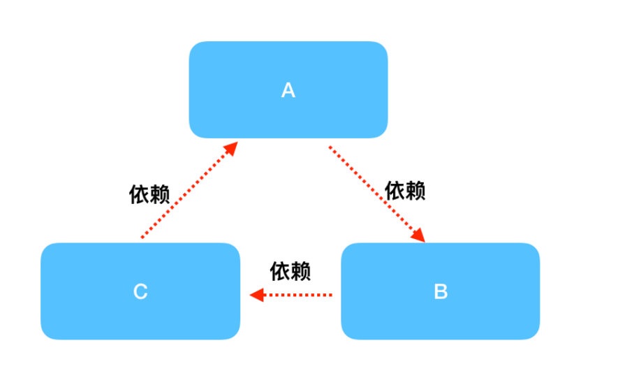
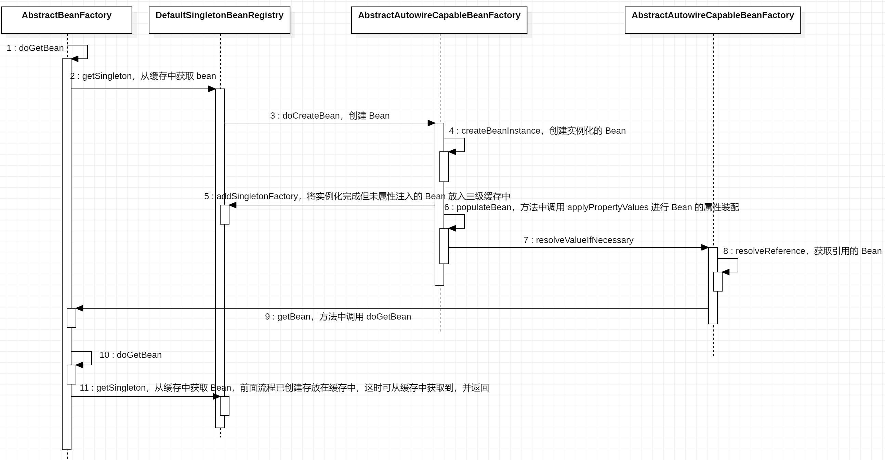

### 循环依赖的产生
　　以下面代码为例，A 依赖 B，B 依赖 A。

```java
@Component
public class A {
  private B b;
  public void setB(B b) {
    this.b = b;
  }
}
@Component
public class B {
  private A a;
  public void setA(A a) {
    this.a = a;
  }
}
```

- Spring 发现 A 对象，实例化 A，但没有放到 Spring 对象池（一级缓存中）；
- A 对象还需要完成初始化，注入属性 B，于是从 Spring 对象池中获取 B 实例；
- 但没获取到，于是 Spring 会进入到 B 属性，同样是实例化 B，但没放到 Spring 对象池中；
- 然后在获取属性 A 时也没有从 Spring 对象池中获取到，这时又会进入 A 对象进行创建;
- 至此，循环依赖就产生了，进入到 A -> B -> A -> B... 的流程。



　　循环依赖的原理类似死锁，解决方法同死锁一样，**需要打破一方依赖，Spring 使用三级缓存来解决。**

### Spring 的三种循环依赖

- 构造器的循环依赖，处理不了，直接抛出 BeanCurrentlylnCreationException 异常；
- 非单例的循环依赖，处理不了；
- 单例模式的 setter 或 @Autowired 循环依赖，通过三级缓存来处理。

### 一级、二级、三级缓存介绍

- **singletonObjects，一级缓存。** 用于存放已实例化和初始化完成（属性赋值）的 Bean，即我们常用到 Bean；
- **earlySingletonObjects，二级缓存。** 存放已实例化但未初始化的 Bean 引用；
- **singletonFactories，三级缓存。** 存放已实例化，但未初始化的 Bean 工厂。

```java
	/** Cache of singleton objects: bean name to bean instance. */
	private final Map<String, Object> singletonObjects = new ConcurrentHashMap<>(256);

	/** Cache of singleton factories: bean name to ObjectFactory. */
	private final Map<String, ObjectFactory<?>> singletonFactories = new HashMap<>(16);

	/** Cache of early singleton objects: bean name to bean instance. */
	private final Map<String, Object> earlySingletonObjects = new HashMap<>(16);
```

　　二级缓存和三级缓存的区别在于，二级缓存的 Bean 会增加一些扩展功能。比如二级缓存的 Bean 引用为动态代理， 先从三级缓存中获取 Bean，然后为其创建代理对象，之后放到二级缓存中，这也是为什么需要二级缓存的原因。<br />
　　以 B 对象，A 属性为例，使用三级缓存 B 对象获取到的是半成品 A 对象（属性）的原始引用。如果在最后创建完成，放入一级缓存中的完成品 A 是代理引用，这与期望要求的不同，所以会多一个二级缓存，用于存放三级缓存的 Bean 的代理引用。

### 三级缓存的解决思路
　　还是以上面的 A 依赖 B，B 依赖 A 为例。

- Spring 发现 A 对象，实例化 A，但没有放到 Spring 对象池（一级缓存中），将半成品 A 放到三级缓存中；
- A 对象还需要完成初始化，注入属性 B，于是从 Spring 对象池中获取 B 实例；
- 但没获取到，于是 Spring 会进入到 B 属性，同样是实例化 B，但没放到 Spring 对象池中，将半成品 B 放到三级缓存中；
- 接着 B 对象获取属性 A（对象），从三级缓存中获取到半成品 A，进行属性注入，至此 B 对象完成实例化和属性初始化，会放到一级缓存中，并返回；
- A 对象获取到 B 对象，进行属性注入，于是 A 对象也完成实例化和初始化会放到一级缓存中。

　　在 B 进行属性注入，获取 A 对象时，会从三级缓存中先获取一个半成品 A，只有实例化，还没完成属性初始化的 A。这就打破了循环，解决循环依赖。

### 循环依赖流程图

