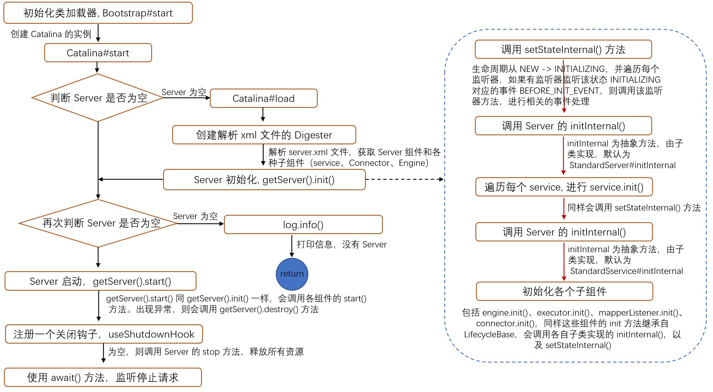
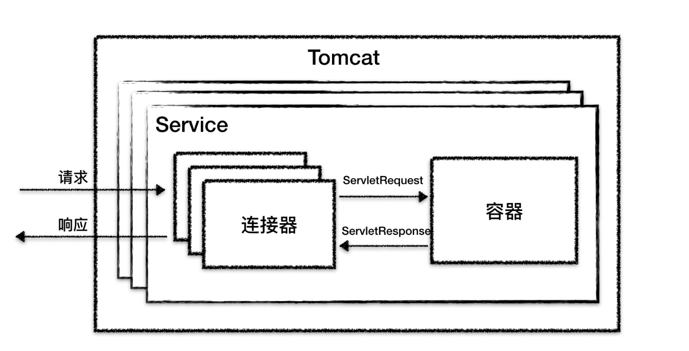
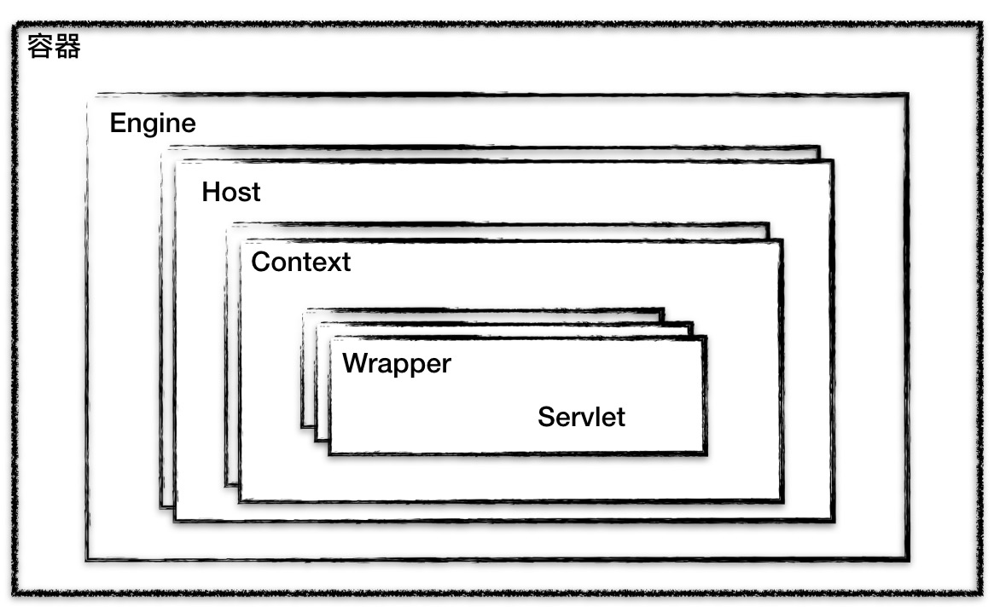

### Tomcat 的启动流程图



### Tomcat 的架构
　　Tomcat 在启动过程前，会先进行初始化，通过解析 server.xml 来创建一个多层的容器。这个容器由多个组件组成，以 server.xml 为例，这个 xml 文件包含了要启动的各组件。

```xml
<Server>
    <Service>
        <Connector />
        <Connector />
        <Engine>
            <Host>
                <Context />
            </Host>
        </Engine>
    </Service>
</Server>
```
  
- **最顶层组件为 Server，** Tomcat 在初始化时会首先创建一个 Server。通过创建 Digester 来解析 xml 文件，使用反射创建 StandardServer（默认的 server）；
- **顶层组件为 Service，一个 Server 可以有多个 Service，** 在代码里 [StandardServer#initInternal](https://github.com/martin-1992/Tomcat-Notes/blob/master/Tomcat%20%E7%9A%84%E5%90%AF%E5%8A%A8%E8%BF%87%E7%A8%8B/StandardServer%23initInternal.md) 可看到会遍历每个 Service 的 init() 方法，在 init() 方法中每个 Service 实现自己的 initInternal() 方法。达到初始化一个 Server 时，会初始化一个或多个 Service。每个 Service 包含多个连接器和一个容器。Service 的主要作用是将连接器和容器包在一起，每个 Service 对应不同的端口号，即对应不同的应用。一个应用监听一个端口号，否则会有端口冲突，导致传过来的数据包不知道给哪个端口号；
- Connector 为连接器组件。连接器负责网络通信，解析应用层协议，并使用适配器模式将 Request / Response 转换为 ServletRequest/ ServletResponse。有多个连接器，是因为不同连接器解析不同协议和支持不同的 I/O 模型，协议有 HTTP 1.1、HTTP 2 ，I/O 模型有 NIO、IO 等；
- Engine 为容器组件，表示引擎，用来管理多个虚拟站点，一个 Server 只有一个 Engine。以 [StandardServcie#initInternal](https://github.com/martin-1992/Tomcat-Notes/blob/master/Tomcat%20%E7%9A%84%E5%90%AF%E5%8A%A8%E8%BF%87%E7%A8%8B/StandardService%23initInternal.md) 为例，使用 engine.init() 对其初始化，这里 engine 为 [StandardEngine]()。容器有四个组件组成，用于接收连接器传来的 ServletRequest/ ServletResponse 进行处理，处理完后在发给连接器，让它发送给对应的客户端；
- Host 为容器组件，表示虚拟主机（域名）。一个 Service 有多个 Host，即多个域名。比如有 localhost、https://manage.shopping.com/ 、https://user.shopping.com/ 等；
- Context 为容器组件，表示一个 Web 应用程序，处理请求；
- Wrapper 为容器组件，表示一个 Servlet。一个 Context 中有多个 Servlet，处理请求。

　　图片来自[深入拆解Tomcat & Jetty](https://time.geekbang.org/column/article/96764)，一个 Tomcat（即 Server）实例包含多个 Service，每个 Service 对应不同的应用，监听不同的端口。一个 Service 包含多个连接器和一个容器。连接器和容器间通过 ServletRequest 和 ServletRespone 进行通信。



### Tomcat 的初始化
　　Tomcat 的组件是存在父子关系的，通过对一个组件的初始化服务，会同时初始化子组件，达到 "一键初始化" 效果。

- [Bootstrap#init]()


### Tomcat 的启动过程

- [Bootstrap#start](https://github.com/martin-1992/Tomcat-Notes/blob/master/Tomcat%20%E7%9A%84%E5%90%AF%E5%8A%A8%E8%BF%87%E7%A8%8B/Bootstrap%23start.md)，使用反射的方法调用 Catalina#start 方法，如果没有 Catalina 实例，则会调用 Bootstrap#init() 方法初始化一个 Catalina 实例；
- [Catalina#start](https://github.com/martin-1992/Tomcat-Notes/blob/master/Tomcat%20%E7%9A%84%E5%90%AF%E5%8A%A8%E8%BF%87%E7%A8%8B/Catalina%23start.md)，使用 Digester 解析 server.xml，创建 Server 组件的实例和各种子组件（GlobalNamingResources、Listener、Service、Executor、Connector）的实例，各组件继承了 [LifecycleBase](https://github.com/martin-1992/Tomcat-Notes/blob/master/LifeCycle/LifecycleBase.md) 的抽象方法 init()，并实现自己的 initInternal() 方法。层层调用，server#init() -> service#init() -> engine#init()、各 executor#init()、mapperListener#init()、各 connectors#init() 等；
    1. [StandardServer#initInternal](https://github.com/martin-1992/Tomcat-Notes/blob/master/Tomcat%20%E7%9A%84%E5%90%AF%E5%8A%A8%E8%BF%87%E7%A8%8B/StandardServer%23initInternal.md)，调用各 Service 组件的 init() 方法；
    2. [StandardService#initInternal](https://github.com/martin-1992/Tomcat-Notes/blob/master/Tomcat%20%E7%9A%84%E5%90%AF%E5%8A%A8%E8%BF%87%E7%A8%8B/StandardService%23initInternal.md)，调用各子组件（如 engine、executor、mapperListener 和 connector）的 init() 方法；
- 当各组件初始化完毕，会调用 Server 的 start 方法，启动 Server，抽象方法 start 中的 startInternal 默认为 [StandardService#startInternal](https://github.com/martin-1992/Tomcat-Notes/blob/master/Tomcat%20%E7%9A%84%E5%90%AF%E5%8A%A8%E8%BF%87%E7%A8%8B/StandardServer%23startInternal.md)，同样 server 会调用各 service 组件的 start() 方法，然后各 service z再调用各子组件的 start() 方法，即 server#start() -> service#start() -> 各 executor#start()、各 connectors#start() 等。

### 容器的结构图
　　图片来自[深入拆解Tomcat & Jetty](https://time.geekbang.org/column/article/96764)。


