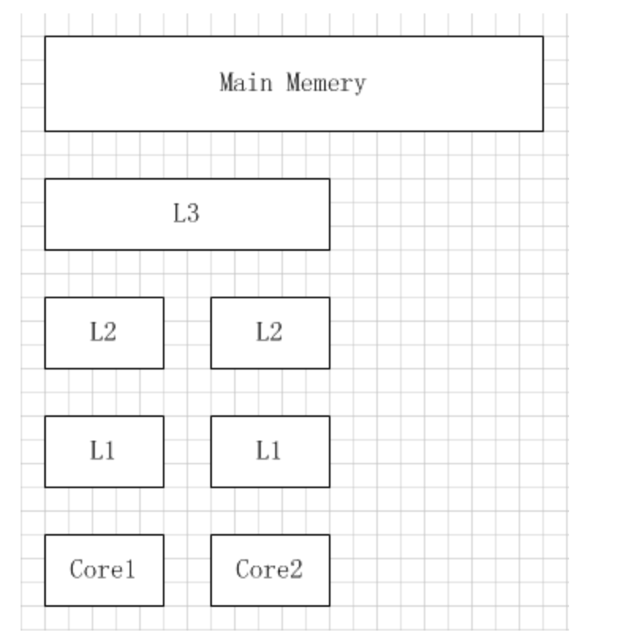
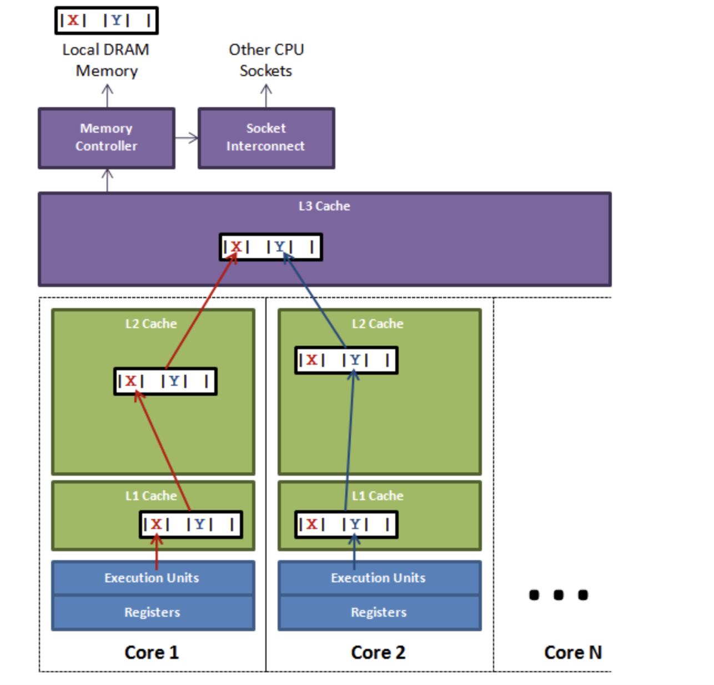

### 概念
　　缓存系统中是以缓存行 cache line 为单位存储的，如果这些变量处在同一个缓存行中，多线程修改这些独立变量时，会影响到其性能，这就是伪共享。 
　　解决伪共享问题的应用可看 Disruptor 队列。

### CPU 缓存
　　位于 CPU 和内存之间的临时存储器，CPU 缓存的读写速度比内存还快，这样 CPU 能更加快地运算和获取，而不必每次都花费较长时间从内存中获取。 
　　CPU 缓存分为一级缓存 L1、二级缓存 L2、三级缓存等 L3，越靠近 CPU 的缓存速度越快，所以 L1 缓存是最快的，但容量最小。查询时，先到 L1 查询，再到 L2、L3，最后到主内存中。

### MESI 协议及 RFO 请求
　　如上图，每个核都有自己私有的 L1、L2 缓存，当另一个核的线程要访问当前核内的 CPU 缓存数据时，**当前核会把数据内容发过去，数据只需要传一次，而不是每次都进行跨核访问。**  
　　缓存行的传输，一个核要要读取另一个核的脏缓存行时，会发生缓存行的传输。判断脏缓存，是通过 MESI 协议。

#### MESI 协议

- M，修改 Modified。本地处理器已经修改缓存行，即是脏行，它的内容与内存中的内容不一样，并且此 cache 只有本地一个拷贝(专有)；
- E，专有 Exclusive。缓存行内容和内存中的一样，而且其它处理器都没有这行数据；
- S，共享 Shared。缓存行内容和内存中的一样, 有可能其它处理器也存在此缓存行的拷贝；
- I，无效 Invalid。缓存行失效，不能使用。

### RFO 请求
　　第一种情况，当 CPU 中的多个核操作同一个缓存行时，会发起 RFO 请求。 
　　另外一种，是线程的工作从一个处理器转移到另一个处理器，需要将该处理器的缓存行数据发送到新处理器的缓存行，即该缓存行在不同核上有多个拷贝。如果新处理器在进行写缓存操作时，则会发送 RFO 请求，使旧处理器的缓存行数据失效。

### 缓存行
　　缓存系统中是以缓存行 cache line 为单位存储的，缓存行通常为 64 字节，以一个 Java 8 字节的 long 变量为例，一个缓存行可存 8 个 long 类型的变量。当访问一个缓存行中的 long 变量时，系统会加载该缓存行的另外 7 个。 
　　但这会带来另一个问题，如果多个线程同时访问或操作该缓存行的不同变量时，就会发生伪共享问题。 

　　如上图，以 Disruptor 项目为例，变量 X 和 Y 由于共享同一缓存行，当更新时需要发送 RFO 请求获得该缓存行的权限，但这会导致该缓存行的数据状态变为无效，其它线程要重新获取。

- core1 的线程要更新变量 X，core2 的线程要更新变量 Y；
- 由于变量 X 和 Y 处于同一个缓存行，两个线程会轮着发送 RFO 请求，获得此缓存行的拥有权；
- 当 core1 获得该缓存行的拥有权后，会更新变量 X。根据 MESI 协议，core2 对该缓存行的状态转为 I（无效状态）。这时 core2 要读取变量 Y 时，不能从该缓存行读取，需要到 L3，甚至是内存中读取，极大的影响读取速度。

### 避免伪共享
　　由于是共享同一个缓存行，导致产生竞争的，解决方法就是避免多个线程操作的变量对象处在同一个缓存行中，即使用缓存行填充 Padding。 
　　一个缓存行有 64 字节，Java 程序的对象头在 32 位系统固定占 8 字节，64 位系统固定占 12 字节。只需要填充 6 个 8 字节的 long 类型，6 * 8 = 48，即可填满整个缓存行。这样另外一个线程的变量就会放到另一个缓存行中，使得两个线程的变量处于不同的缓存行中，达到不同线程操作不同的缓存行。

#### 案例分析
　　比如，JDK 的 LinkedBlockingQueue 中，指向队头的 head 和指向队尾的 tail 可能存在同一个缓存行中。如果在多线程下，则会产生伪共享问题。

### reference

- [伪共享（false sharing），并发编程无声的性能杀手](https://www.cnblogs.com/cyfonly/p/5800758.html)
- [高性能队列——Disruptor](https://tech.meituan.com/2016/11/18/disruptor.html)